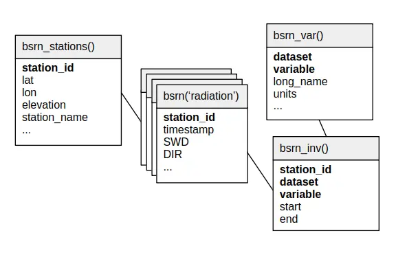

.. _bsrn:

Baseline Surface Radiation Network (BSRN)
=========================================

Description
-----------

.. epigraph::

   The objective of the BSRN is to provide observations of the best possible quality for short- and long-wave surface radiation fluxes with a high sampling rate. These readings are taken from a small number of selected stations, in contrasting climatic zones, together with collocated surface and upper air meteorological data and other supporting observations.
   
   The uniform and consistent measurements throughout the BSRN network are used to:
   
   - monitor the background (least influenced by immediate human activities which are regionally concentrated) short-wave and long-wave radiative components and their changes with the best methods currently available,
   - provide data for the validation and evaluation of satellite-based estimates of the surface radiative fluxes and
   - produce high-quality observational data for comparison to climate model (GCM) calculations and for the development of local regionally representative radiation climatologies.
   
   **Source:** `WRMC on the objectives of GHCNh
   <https://bsrn.awi.de/project/objectives/>`_ (last accessed 2026-03-10)

Relational schema
-----------------

Below is the relational schema of BSRN in SEASTERS.

.. _schema:

      
Variable overview
-----------------

Four dataset types are included in the database, although not all stations provide each
of them.

.. tab-set::

   .. tab-item:: Radiation

      This is the core dataset of BSRN, with "basic measurements of radiation".

      **Query:**

      .. code:: sql

         SELECT variable, long_name, units
         FROM bsrn_var()
         WHERE dataset == 'radiation'
         ORDER BY variable

      **Response:**

      .. code:: console

         ┌─────────────┬────────────────────────────────────────────────────────────┬─────────┐
         │  variable   │                         long_name                          │  units  │
         │   varchar   │                          varchar                           │ varchar │
         ├─────────────┼────────────────────────────────────────────────────────────┼─────────┤
         │ DIF         │ Diffuse radiation                                          │ W/m**2  │
         │ DIF max     │ Diffuse radiation, maximum                                 │ W/m**2  │
         │ DIF min     │ Diffuse radiation, minimum                                 │ W/m**2  │
         │ DIF std dev │ Diffuse radiation, standard deviation                      │ W/m**2  │
         │ DIR         │ Direct radiation                                           │ W/m**2  │
         │ DIR max     │ Direct radiation, maximum                                  │ W/m**2  │
         │ DIR min     │ Direct radiation, minimum                                  │ W/m**2  │
         │ DIR std dev │ Direct radiation, standard deviation                       │ W/m**2  │
         │ LWD         │ Long-wave downward radiation                               │ W/m**2  │
         │ LWD max     │ Long-wave downward radiation, maximum                      │ W/m**2  │
         │ LWD min     │ Long-wave downward radiation, minimum                      │ W/m**2  │
         │ LWD std dev │ Long-wave downward radiation, standard deviation           │ W/m**2  │
         │ PoPoPoPo    │ Station pressure                                           │ hPa     │
         │ RH          │ Humidity, relative                                         │ %       │
         │ SWD         │ Short-wave downward (GLOBAL) radiation                     │ W/m**2  │
         │ SWD max     │ Short-wave downward (GLOBAL) radiation, maximum            │ W/m**2  │
         │ SWD min     │ Short-wave downward (GLOBAL) radiation, minimum            │ W/m**2  │
         │ SWD std dev │ Short-wave downward (GLOBAL) radiation, standard deviation │ W/m**2  │
         │ T2          │ Air temperature at 2 m height                              │ °C      │
         ├─────────────┴────────────────────────────────────────────────────────────┴─────────┤
         │ 19 rows                                                                  3 columns │
         └────────────────────────────────────────────────────────────────────────────────────┘

   .. tab-item:: 10 m radiation

      Some stations provide this additional dataset, with "other measurements at 10 m".

      **Query:**

      .. code:: sql

         SELECT variable, long_name, units
         FROM bsrn_var()
         WHERE dataset == 'radiation_10m'
         ORDER BY variable

      **Response:**

      .. code:: console

         ┌──────────┬──────────────────────────────────────┬─────────┐
         │ variable │              long_name               │  units  │
         │ varchar  │               varchar                │ varchar │
         ├──────────┼──────────────────────────────────────┼─────────┤
         │ LWU      │ Long-wave upward radiation           │ W/m**2  │
         │ SWU      │ Short-wave upward (REFLEX) radiation │ W/m**2  │
         └──────────┴──────────────────────────────────────┴─────────┘

   .. tab-item:: Radiosonde

      "Radiosonde measurements" are indexed by a pair of ``timestamp`` and ``Altitude``
      fields, providing measurements along a vertical axis above the station.

      **Query:**

      .. code:: sql

         SELECT variable, long_name, units
         FROM bsrn_var()
         WHERE dataset == 'radiosonde'
         ORDER BY variable

      **Response:**

      .. code:: console

         ┌──────────┬─────────────────────────────┬─────────┐
         │ variable │          long_name          │  units  │
         │ varchar  │           varchar           │ varchar │
         ├──────────┼─────────────────────────────┼─────────┤
         │ Altitude │ ALTITUDE                    │ m       │
         │ PPPP     │ Pressure, at given altitude │ hPa     │
         │ TTT      │ Temperature, air            │ °C      │
         │ TdTdTd   │ Dew/frost point             │ °C      │
         │ dd       │ Wind direction              │ deg     │
         │ ff       │ Wind speed                  │ m/s     │
         └──────────┴─────────────────────────────┴─────────┘

   .. tab-item:: SYNOP

      Some stations lastly provide "meteorological synoptical observations". 

      **Query:**

      .. code:: sql

         SELECT variable, long_name, units
         FROM bsrn_var()
         WHERE dataset == 'SYNOP'
         ORDER BY variable

      **Response:**

      .. code:: console

         ┌──────────┬───────────────────────────────────────┬─────────┐
         │ variable │               long_name               │  units  │
         │ varchar  │                varchar                │ varchar │
         ├──────────┼───────────────────────────────────────┼─────────┤
         │ CH       │ High cloud                            │ code    │
         │ CL       │ Low cloud                             │ code    │
         │ CM       │ Middle cloud                          │ code    │
         │ N        │ Total cloud amount                    │ code    │
         │ Nh       │ Low/middle cloud amount               │ code    │
         │ PPPP     │ Station pressure reduced to sea level │ hPa     │
         │ TTT      │ Temperature, air                      │ °C      │
         │ TdTdTd   │ Dew/frost point                       │ °C      │
         │ VV       │ Horizontal visibility                 │ code    │
         │ dd       │ Wind direction                        │ deg     │
         │ ff       │ Wind speed                            │ m/s     │
         │ h        │ Cloud base height                     │ code    │
         │ ww       │ Present weather                       │ code    │
         ├──────────┴───────────────────────────────────────┴─────────┤
         │ 13 rows                                          3 columns │
         └────────────────────────────────────────────────────────────┘
   

.. important::

   Items of the ``variable`` columns above are the fields (column names) of the main
   table's data records in ``bsrn()``.

.. _bsrn-cite:

How to cite?
------------

In the BSRN network, one PI is assigned to one station for a given period: depending on
the station and period you look up to, the citation to use is not the same.
Furthermore, some station records are not grouped into collections and were thus retrieved
from monthly individual datasets, making many references to cite. The BSRN `Data Release
Guidelines <https://bsrn.awi.de/data/conditions-of-data-release/>`_ are nevertheless
clear: "*the use of a particular station's data and the World Radiation Monitoring
Center (WRMC) must always be explicitly acknowledged (= cited)*". So... brace
yourself, and you can download the full list of citations from the following:
:download:`bsrn_citations.txt <../_static/bsrn_citations.txt>`.

In case you want to cite BSRN in general (although it remains mandatory to cite the
exact datasets you use), you can cite Driemel et al. (2018).

References
----------

.. bibliography::
   :list: bullet
   :filter: key % "BSRN:"
