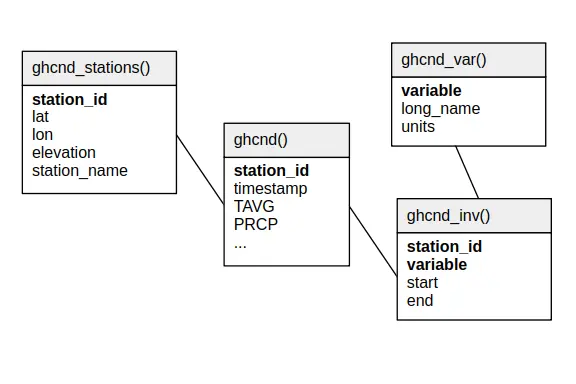

.. _ghcnd:

Global Historical Climatology Network daily (GHCNd)
===================================================

Description
-----------

.. epigraph::

   The Global Historical Climatology Network daily (GHCNd) is an integrated database of
   daily climate summaries from land surface stations across the globe. GHCNd is made up
   of daily climate records from numerous sources that have been integrated and
   subjected to a common suite of quality assurance reviews.

   GHCNd contains records from more than 100,000 stations in 180 countries and
   territories. NCEI provides numerous daily variables, including maximum and minimum
   temperature, total daily precipitation, snowfall, and snow depth.
   About half the stations only report precipitation. Both record length and period of
   record vary by station and cover intervals ranging from less than a year to more than
   175 years.

   **Source:** `NOAA NCEI on GHCNd <https://www.ncei.noaa.gov/products/land-based-station/global-historical-climatology-network-daily>`_
   (last accessed 2025-04-30)

Relational schema
-----------------

Below is the relational schema of GHCNd in SEASTERS.

.. _schema:

Variable overview
-----------------

**Query:**

.. code:: sql
   
   SELECT *
   FROM ghcnd_var()
   ORDER BY variable

**Response:**

.. code:: console

   ┌──────────┬──────────────────────────────────────────────────────┬────────────────────┐
   │ variable │                      long_name                       │       units        │
   │ varchar  │                       varchar                        │      varchar       │
   ├──────────┼──────────────────────────────────────────────────────┼────────────────────┤
   │ ACMH     │ Average cloudiness midnight to midnight (manual)     │ %                  │
   │ ACSH     │ Average cloudiness sunrise to sunset (manual)        │ %                  │
   │ ADPT     │ Average Dew Point Temperature                        │ 0.1 degree Celsius │
   │ ASLP     │ Average Sea Level Pressure                           │ hPa*10             │
   │ ASTP     │ Average Station Level Pressure                       │ hPa*10             │
   │ AWBT     │ Average Wet Bulb Temperature                         │ 0.1 degree Celsius │
   │ AWND     │ Average daily wind speed                             │ 0.1 m/s            │
   │ DAEV     │ Days included in multiday evaporation total (MDEV)   │ days               │
   │ DAPR     │ Days included in multiday precipitation total (MDPR) │ days               │
   │ DATN     │ Days included in multiday minimum temperature (MDTN) │ days               │
   │ DATX     │ Days included in multiday maximum temperature (MDTX) │ days               │
   │ DAWM     │ Days included in multiday wind movement (MDWM)       │ days               │
   │ DWPR     │ Days with non-zero precipitation in MDPR             │ days               │
   │ EVAP     │ Evaporation                                          │ 0.1 mm             │
   │ FMTM     │ Time of fastest mile / fastest 1-minute wind         │ HHMM               │
   │ MDEV     │ Multiday evaporation total                           │ 0.1 mm             │
   │ MDPR     │ Multiday precipitation total                         │ 0.1 mm             │
   │ MDTN     │ Multiday minimum temperature                         │ 0.1 degree Celsius │
   │ MDTX     │ Multiday maximum temperature                         │ 0.1 degree Celsius │
   │ MDWM     │ Multiday wind movement                               │ km                 │
   │ MNPN     │ Daily minimum pan water temperature                  │ 0.1 degree Celsius │
   │ MXPN     │ Daily maximum pan water temperature                  │ 0.1 degree Celsius │
   │ PGTM     │ Peak gust time                                       │ HHMM               │
   │ PRCP     │ Precipitation                                        │ 0.1 mm             │
   │ PSUN     │ Daily percent of possible sunshine                   │ %                  │
   │ RHAV     │ Average relative humidity                            │ %                  │
   │ RHMN     │ Minimum relative humidity                            │ %                  │
   │ RHMX     │ Maximum relative humidity                            │ %                  │
   │ SNOW     │ Snowfall                                             │ mm                 │
   │ SNWD     │ Snow depth                                           │ mm                 │
   │ TAVG     │ Average daily temperature                            │ 0.1 degree Celsius │
   │ THIC     │ Thickness of ice on water                            │ 0.1 mm             │
   │ TMAX     │ Maximum temperature                                  │ 0.1 degree Celsius │
   │ TMIN     │ Minimum temperature                                  │ 0.1 degree Celsius │
   │ TOBS     │ Temperature at observation time                      │ 0.1 degree Celsius │
   │ TSUN     │ Daily total sunshine                                 │ minutes            │
   │ WDF1     │ Direction of fastest 1-minute wind                   │ degrees            │
   │ WDF2     │ Direction of fastest 2-minute wind                   │ degrees            │
   │ WDF5     │ Direction of fastest 5-second wind                   │ degrees            │
   │ WDFG     │ Direction of peak wind gust                          │ degrees            │
   │ WDFM     │ Fastest mile wind direction                          │ degrees            │
   │ WDMV     │ 24-hour wind movement                                │ km                 │
   │ WESD     │ Water equivalent of snow on the ground               │ 0.1 mm             │
   │ WSF1     │ Fastest 1-minute wind speed                          │ 0.1 m/s            │
   │ WSF2     │ Fastest 2-minute wind speed                          │ 0.1 m/s            │
   │ WSF5     │ Fastest 5-second wind speed                          │ 0.1 m/s            │
   │ WSFG     │ Peak gust wind speed                                 │ 0.1 m/s            │
   │ WSFM     │ Fastest mile wind speed                              │ 0.1 m/s            │
   │ WT01     │ Fog, ice fog, or freezing fog                        │ code               │
   │ WT02     │ Heavy fog or heavy freezing fog                      │ code               │
   │ WT03     │ Thunder                                              │ code               │
   │ WT04     │ Ice pellets, sleet, snow pellets, or small hail      │ code               │
   │ WT05     │ Hail                                                 │ code               │
   │ WT06     │ Glaze or rime                                        │ code               │
   │ WT07     │ Dust, volcanic ash, blowing dust/sand/obstruction    │ code               │
   │ WT08     │ Smoke or haze                                        │ code               │
   │ WT10     │ Tornado, waterspout, or funnel cloud                 │ code               │
   │ WT11     │ High or damaging winds                               │ code               │
   │ WT12     │ Blowing spray                                        │ code               │
   │ WT13     │ Mist                                                 │ code               │
   │ WT14     │ Drizzle                                              │ code               │
   │ WT16     │ Rain                                                 │ code               │
   │ WT17     │ Freezing rain                                        │ code               │
   │ WT18     │ Snow, snow pellets, snow grains, or ice crystals     │ code               │
   │ WT19     │ Unknown source of precipitation                      │ code               │
   │ WT21     │ Ground fog                                           │ code               │
   │ WV20     │ Rain or snow shower in the vicinity                  │ code               │
   ├──────────┴──────────────────────────────────────────────────────┴────────────────────┤
   │ 67 rows                                                                    3 columns │
   └──────────────────────────────────────────────────────────────────────────────────────┘

.. important::

   Items of the ``variable`` column above are the fields (column names) of the main
   table's data records in ``ghcnd()``.

.. attention::

   ``TAVG`` is computed in a variety of ways depending on the station. For some
   stations for instance, ``TAVG`` points to a single daily measurement made at
   traditional fixed hours of the day.

Station names and IDs
---------------------

.. _ghcnd-station-id:

Station IDs
~~~~~~~~~~~

Station IDs are eleven-character long, in the following form:

.. code:: console

   FFNIIIIIIII

e.g., ``ASM00094299``, where (the following is derived from GHCNd documentation):

* ``FF`` is a 2 character `FIPS 10-4 code <https://en.wikipedia.org/wiki/FIPS_10-4>`_
  indicating the territory (``AS`` in the example, for "Australia").

* ``N`` is a 1 character "network" code indicating how to interpret the following eight
  characters (``M`` in the example, indicating -- refering to the table below --
  that the last five characters will make the station's WMO ID).
  Below are the potential network code values with their meaning:

  .. list-table::
     :header-rows: 1

     * - Network code
       - Meaning
     * - 0
       - Unspecified (station identified by up to eight
         alphanumeric characters)
     * - 1
       - Community Collaborative Rain, Hail,and Snow (CoCoRaHS)
         based identification number.  To ensure consistency with
         with GHCN Daily, all numbers in the original CoCoRaHS IDs
         have been left-filled to make them all four digits long.
         In addition, the characters ``-`` and ``_`` have been removed
         to ensure that the IDs do not exceed 11 characters when
         preceded by ``US1``. For example, the CoCoRaHS ID
         ``AZ-MR-156`` becomes ``US1AZMR0156`` in GHCN-Daily
     * - C
       - U.S. Cooperative Network identification number (last six
         characters of the GHCN-Daily ID)
     * - E
       - Identification number used in the ECA&D non-blended
         dataset
     * - M
       - World Meteorological Organization ID (last five
         characters of the GHCN-Daily ID)
     * - N
       - Identification number used in data supplied by a
         National Meteorological or Hydrological Center
     * - P
       - "Pre-Coop" (an internal identifier assigned by NCEI for station
         records collected prior to the establishment of the U.S. Weather
         Bureau and their management of the U.S. Cooperative (Coop)
         Observer Program
     * - R
       - U.S. Interagency Remote Automatic Weather Station (RAWS)
         identifier
     * - S
       - U.S. Natural Resources Conservation Service SNOwpack
         TELemtry (SNOTEL) station identifier
     * - W
       - WBAN identification number (last five characters of the
         GHCN-Daily ID)

* ``IIIIIIII`` is the actual 8 character ID of the station, to be read based on the
  associated network ``N`` (``00094299`` in the example, meaning that, since the network
  code was ``M``, the first three zeros are to be ignored, and the last five characters
  constitude the WMO ID, i.e., ``94299``).

.. tip::

   Such station ID formatting can be used to filter stations when loading data,
   e.g., with SEASTERSdb
   :func:`~seastersdb.gauge_data_loaders.load_1h_gauge_data`
   function. For instance, Indonesian stations could be selected using the following
   ``filter_condition`` argument: ``filter_condition='station_id[:2] == "ID"'``.

.. _ghcnd-station-name:

Station names
~~~~~~~~~~~~~

Station names are formatted as follows:

.. code:: console

   <name> [US=<US state>, GSN=<GSN flag>, HCN=<HCN/CRN flag>, WMO=<WMO ID>]

where information between square brackets is not present for all stations. For instance,
the station with ``station_id='ASM00094299'`` has the following ``station_name``:

.. code:: console

   WILLIS ISLAND [GSN=GSN, WMO=94299]

Below are explanations on the flags, derived from from GHCNd documentation:

* ``<US state>`` is the U.S. postal code for the state (for U.S. stations only).

* ``<GSN flag>`` is a flag that indicates whether the station is part of the GCOS
  Surface Network (GSN). The flag is assigned by cross-referencing
  the number in the WMO ID field with the official list of GSN
  stations. The flag equals ``GSN`` if the station is part of the network, and is blank
  otherwise.

* ``<HCN/CRN flag>`` is a flag that indicates whether the station is part of the U.S.
  Historical Climatology Network (HCN) or U.S. Climate Reference Network (CRN; also
  includes U.S. Regional Climate Network stations).
  The flag equals ``HCN`` if the former, ``CRN`` if the latter, and is blank otherwise.

* ``<WMO ID>`` is the World Meteorological Organization (WMO) number for the
  station. If the station has no WMO number (or one has not yet been matched to this
  station), then the field is blank.

How to cite?
------------

This is GHCNd **version 3.32**, **accessed April 9th, 2025**.
The documentation indicates to cite the dataset using Menne et al. (2012a,b).

References
----------

.. bibliography::
   :list: bullet
   :filter: key % "GHCNd:"
