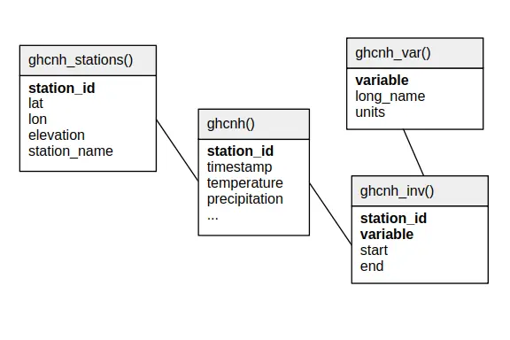

.. _ghcnh:

Global Historical Climatology Network hourly (GHCNh)
====================================================

Description
-----------

.. epigraph::

   The Global Historical Climatology Network hourly (GHCNh) is a next generation
   hourly/synoptic dataset that replaces the Integrated Surface Dataset (ISD). GHCNh
   consists of hourly and synoptic surface weather observations from fixed, land-based
   stations. This dataset is compiled from numerous data sources maintained by NOAA, the
   U.S. Air Force, and many other meteorological agencies (Met Services) around the
   world. These sources have been reformatted into a common data format and then
   harmonized into a set of unique period-of-record station files, which are then
   provided as GHCNh.

   **Source:** `NOAA NCEI on GHCNh <https://www.ncei.noaa.gov/products/global-historical-climatology-network-hourly>`_
   (last accessed 2025-05-12)

Relational schema
-----------------

Below is the relational schema of GHCNh in SEASTERS.

.. _schema:

Variable overview
-----------------

**Query:**

.. code:: sql

   SELECT *
   FROM ghcnh_var()
   ORDER BY variable

**Response:**

.. code:: console

   ┌────────────────────────┬─────────────────────────┬────────────┐
   │        variable        │        long_name        │   units    │
   │        varchar         │         varchar         │  varchar   │
   ├────────────────────────┼─────────────────────────┼────────────┤
   │ altimeter              │ Altimeter Pressure      │ hPa        │
   │ dew_point_temperature  │ Dew Point Temperature   │ °C         │
   │ precipitation          │ Hourly Precipitation    │ mm         │
   │ precipitation_12_hour  │ 12-hour Precipitation   │ mm         │
   │ precipitation_15_hour  │ 15-hour Precipitation   │ mm         │
   │ precipitation_18_hour  │ 18-hour Precipitation   │ mm         │
   │ precipitation_21_hour  │ 21-hour Precipitation   │ mm         │
   │ precipitation_24_hour  │ 24-hour Precipitation   │ mm         │
   │ precipitation_3_hour   │ 3-hour Precipitation    │ mm         │
   │ precipitation_6_hour   │ 6-hour Precipitation    │ mm         │
   │ precipitation_9_hour   │ 9-hour Precipitation    │ mm         │
   │ pres_wx_AU1            │ Present weather AU1     │ code       │
   │ pres_wx_AU2            │ Present weather AU2     │ code       │
   │ pres_wx_AU3            │ Present weather AU3     │ code       │
   │ pres_wx_AW1            │ Present weather AW1     │ code       │
   │ pres_wx_AW2            │ Present weather AW2     │ code       │
   │ pres_wx_AW3            │ Present weather AW3     │ code       │
   │ pres_wx_MW1            │ Present weather MW1     │ code       │
   │ pres_wx_MW2            │ Present weather MW2     │ code       │
   │ pres_wx_MW3            │ Present weather MW3     │ code       │
   │ pressure_3hr_change    │ 3-hour Pressure Change  │ hPa        │
   │ relative_humidity      │ Relative Humidity       │ %          │
   │ remarks                │ Hourly Remarks          │ NULL       │
   │ sea_level_pressure     │ Sea Level Pressure      │ hPa        │
   │ sky_cover_1            │ Sky Cover Layer 1       │ oktas/code │
   │ sky_cover_2            │ Sky Cover Layer 2       │ oktas/code │
   │ sky_cover_3            │ Sky Cover Layer 3       │ oktas/code │
   │ sky_cover_baseht_1     │ Sky Cover Base Height 1 │ m          │
   │ sky_cover_baseht_2     │ Sky Cover Base Height 2 │ m          │
   │ sky_cover_baseht_3     │ Sky Cover Base Height 3 │ m          │
   │ snow_depth             │ Snow Depth              │ mm         │
   │ station_level_pressure │ Station Level Pressure  │ hPa        │
   │ temperature            │ Air Temperature at 2 m  │ °C         │
   │ visibility             │ Visibility              │ km         │
   │ wet_bulb_temperature   │ Wet Bulb Temperature    │ °C         │
   │ wind_direction         │ Wind Direction          │ degrees    │
   │ wind_gust              │ Peak Wind Gust          │ m/s        │
   │ wind_speed             │ Wind Speed              │ m/s        │
   ├────────────────────────┴─────────────────────────┴────────────┤
   │ 38 rows                                             3 columns │
   └───────────────────────────────────────────────────────────────┘

.. important::

   Items of the ``variable`` column above are the fields (column names) of the main
   table's data records in ``ghcnh()``.

Station names and IDs
---------------------

.. _ghcnh-station-id:

Station IDs
~~~~~~~~~~~

Station IDs are eleven-character long, in the following form:

.. code:: console

   FFNIIIIIIII

e.g., ``GQW00041406``, where (the following is derived from GHCNh documentation):

* ``FF`` is a 2 character `FIPS 10-4 code <https://en.wikipedia.org/wiki/FIPS_10-4>`_
  indicating the territory (``GQ`` in the example, for "Guam").

* ``N`` is a 1 character "network" code indicating how to interpret the following eight
  characters (``W`` in the example, indicating -- refering to the table below --
  that the last five characters will make the station's WBAN identification number).
  Below are the potential network code values with their meaning:

  .. list-table::
     :header-rows: 1

     * - Network code
       - Meaning
     * - A
       - Retired WMO Identifier used by the USAF 14th Weather Squadron
     * - U
       - Unspecified (station identified by up to eight alphanumeric characters)
     * - C
       - U.S. Cooperative Network identification number
         (last six characters of the GHCN ID)
     * - I
       - International Civil Aviation Organization (ICAO) identifier
     * - M
       - World Meteorological Organization ID (last five characters of the GHCN ID)
     * - N
       - Identification number used by a National Meteorological or Hydrological Center
         partner
     * - L
       - U.S. National Weather Service Location Identifier (NWSLI)
     * - W
       - WBAN identification number (last five characters of the GHCN ID)

* ``IIIIIIII`` is the actual 8 character ID of the station, to be read based on the
  associated network ``N`` (``00041406`` in the example, meaning that, since the network
  code was ``W``, the first three zeros are to be ignored, and the last five characters
  constitude the WBAN ID, i.e., ``41406``).

.. _ghcnh-station-name:

Station names
~~~~~~~~~~~~~

Station names are formatted as follows:

.. code:: console

   <name> [US=<US state>, GSN=<GSN flag>, HCN=<HCN/CRN flag>, WMO=<WMO ID>]

where information between square brackets is not present for all stations. For instance,
the station with ``station_id='GQW00041406'`` has the following ``station_name``:

.. code:: console

   GUAM WFO [WMO=91212]

Below are explanations on the flags, derived from from GHCNh documentation:

* ``<US state>`` is the U.S. postal code for the state (for U.S. stations only).

* ``<GSN flag>`` is a flag that indicates whether the station is part of the GCOS
  Surface Network (GSN). The flag is assigned by cross-referencing
  the number in the WMO ID field with the official list of GSN
  stations. The flag equals ``GSN`` if the station is part of the network, and is blank
  otherwise.

* ``<HCN/CRN flag>`` is a flag that indicates whether the station is part of the U.S.
  Historical Climatology Network (HCN) or U.S. Climate Reference Network (CRN; also
  includes U.S. Regional Climate Network stations).
  The flag equals ``HCN`` if the former, ``CRN`` if the latter, and is blank otherwise.

* ``<WMO ID>`` is the World Meteorological Organization (WMO) number for the
  station. If the station has no WMO number (or one has not yet been matched to this
  station), then the field is blank.

How to cite?
------------

This is GHCNh **version 1.0.1**, **accessed May 12th, 2025**.
The documentation indicates to cite the dataset using Menne et al. (2023).

References
----------

.. bibliography::
   :list: bullet
   :filter: key % "GHCNh:"
