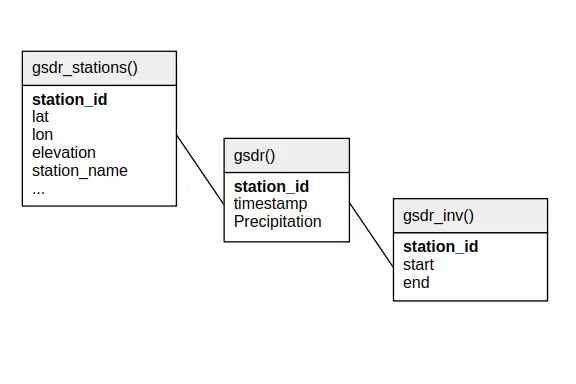

.. _gsdr:

Global Sub-Daily Rainfall (GSDR)
================================

Description
-----------

.. epigraph::

   Extreme short-duration rainfall can cause devastating flooding that puts lives,
   infrastructure, and natural ecosystems at risk. It is therefore essential to
   understand how this type of extreme rainfall will change in a warmer world. A
   significant barrier to answering this question is the lack of sub-daily rainfall data
   available at the global scale. To this end, a global sub-daily rainfall dataset based
   on gauged observations has been collated. The dataset is highly variable in its
   spatial coverage, record length, completeness and, in its raw form, quality. This
   presents significant difficulties for many types of analyses. The dataset currently
   comprises 23 687 gauges with an average record length of 13 years. Apart from a few
   exceptions, the earliest records begin in the 1950s. The Global Sub-Daily Rainfall
   Dataset (GSDR) has wide applications, including improving our understanding of the
   nature and drivers of sub-daily rainfall extremes, improving and validating of
   high-resolution climate models, and developing a high-resolution gridded sub-daily
   rainfall dataset of indices.

   **Source:** Absract of Lewis et al. (2019).

.. note::

   In SEASTERS, we included the stations from four countries: Japan, Malaysia, India and
   Australia.

.. attention::

   The GSDR dataset is **not publicly distributed!** Before using this data for
   published work, please first contact the CNRM branch of SEASTERS -- who we got
   this data from -- to get the approval of the team behind the dataset. Also check
   this page's :ref:`How to cite <gsdr-cite>` section.

Relational schema
-----------------

Below is the relational schema of GSDR in SEASTERS.
The only variable in this dataset is ``Precipitation``, stored in millimeters.

.. _schema:

Station names and IDs
---------------------

Station IDs
~~~~~~~~~~~

Station IDs are quite diverse across countries. In GSDR, they have been formatted as
``<ISO_alpha-2>_<national_station_id>``, where ``<ISO_alpha-2>`` refers to a 2 character
country code of the `ISO 3166 standard <https://en.wikipedia.org/wiki/ISO_3166>`_.

For instance, ``IN_33`` is the ID of a station located in India, and
``MY_pahang_4023001`` that of a station located in Malaysia.

Station names
~~~~~~~~~~~~~

There's nothing fancy about station names. Simply note that their source country is
indicated between parentheses, e.g., with ``IKEDA (Japan)`` for the ``JP_20441``
Japanese station.

About quality checks
--------------------

This section is adpated from the supplementary of Moron et al. (2024). The "We" refers
to the team behind the dataset.

Criteria of dubious records
~~~~~~~~~~~~~~~~~~~~~~~~~~~

We consider three additional checks to remove dubious records or rain gauges ;

#. Hourly records >= 300 mm;
#. Very long sequences of zeros rainfall which could indicate spurious filling of
   missing data;
#. Long sequences of the same hourly amounts which could indicate spurious
   repetitions.

We considered first any hourly record >= 300 mm as dubious, since it is close to the
official WMO world record of 305 mm recorded at Holt (Missouri, USA) on June 22, 1947
(`source <https://wmo.int/sites/default/files/2024-01/Table_Extreme_Records_30Jan2024.pdf>`_).
We also checked if the surrounding stations within a radius of 50 km (if there are
some available stations) receive significant hourly rainfall >= 10 mm.

The second criteria about the consecutive zeros may be a priori irrelevant for our
main purpose, which is the analysis of wet spells, but any spurious sequence of zeros
will bias any monthly or seasonal amounts, which are also analyzed.

The main theoretical issue related to the second and third criteria is the lack of
any predefined and unique threshold to decide if a dry or a constant sequence is
spurious or not. The second criteria depends clearly on the mean annual cycle and the
length of the usual dry season. For example, 9 or 10 consecutive months without any
rainfall is highly probable for central Australia or NW India, while it would be
highly dubious for a rain gauge located either on the windward side of a tropical
island, along the western Ghats in India, or close to the equator in Malaysia.

About the third criteria, we decided that any sequence of constant rainfall >= 1 mm
lasting at least 6 consecutive hours is dubious.

We detail in the following each of the network.

India
~~~~~

The Indian database includes 62 stations having at least 8760 x 5 hourly
records and the highest hourly rainfall is 150 mm. The longest sequence of zeros
rainfall lasts 7700 hours and occurs at Jaisalmer, which is the driest rain gauge
(mean annual amount = 225 mm) and thus appears reasonable. There are two occurrences
of 7 and 11 consecutive hours with a constant amount, which are replaced by missing
entries.

Australia
~~~~~~~~~

The Australian database includes 531 stations having at least 8760 x 5
hourly records. A single station has hourly records >= 300 mm, and the three records
are consecutive, which is impossible. So, these records are replaced by missing
entries. 6 stations have at least one year without any rainfall (maximum is 480
days), but these stations receive less than 50 mm of annual rainfall in mean. 13
stations have at least ¾ of a year fully dry. Again, their mean annual rainfall is
<= 100 mm, so compatible with such long dry sequences. 0.0015 % of the available
hourly data are included in wet spells with a constant value and lasting at least 6
hours and the corresponding hours have been replaced by missing entries. The highest
hourly rainfall is 272 mm.

Malaysia
~~~~~~~~

The Malaysian database is the most problematic. There are 200 stations
with at least 8760 x 5 available hours. There are 5155 hourly records >= 300 mm but
they are heavily concentrated in 2 rain gauges (with respectively 4832 and 283 cases)
with a repetition of the same (very high) values. Both stations are removed from the
database. In the remaining 11 stations containing between 1 and 10 hourly records >=
300 mm, we checked the hourly amounts recorded at stations within a radius of 50 km.
Only 4 cases (out of 40) have at least one surrounding station receiving >= 10 mm
(maximum = 62 mm) during a >= 300 mm event. We choose a conservative approach to
replace all these records >= 300 mm by missing entries. Only 25 hourly records are >=
200 mm after this first cleaning. 11.35 % of available hourly records are included in
an absolute dry spell lasting at least 6 consecutive months -- sometimes 10
consecutive years are dry--, which is highly spurious in a wet country as Malaysia,
especially with two wet seasons even if they are not equally abundant across the
country. After having replaced the corresponding values by missing entries, one
station does not fill anymore the criteria of the 8760 x 5 available entries and is
discarded. 0.25 % of the available hourly data are included in wet spells with a
constant value and lasting at least 6 hours and the corresponding hours have been
replaced by missing entries.

Japan
~~~~~

The Japanese network contains 37 stations with a maximum hourly record of
152 mm and a longest dry spell of 49 days. Only 0.0076 % of the available hourly
records are included in a wet spell with constant values and lasting at least 6 hours
and are replaced with missing entries.

.. _gsdr-cite:

How to cite?
------------

The documentation does not indicate any version, doi or dataset-type citation.
We suggest simply citing Lewis et al. (2019).

.. attention::

   The GSDR dataset is **not publicly distributed!** Before using this data for
   published work, please first contact the CNRM branch of SEASTERS -- who we got
   this data from -- to get the approval of the team behind the dataset.

References
----------

.. bibliography::
   :list: bullet
   :filter: key % "GSDR:"
