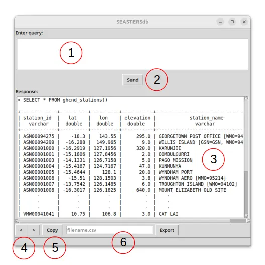

Interactive session
===================

To open seastersdb interactive session, simply type the following from a terminal with
your ``seasters`` environment activated:

.. code:: shell

   seastersdb &

A window should open as in the following image. The interface is quite simple:

#. On top is the area to type your :ref:`SQL query <sql>`. ``Enter`` breaks
   line within this query; and ``Ctrl + Enter`` is equivalent to clicking on the *Send*
   button. After sending your first query, you may use the ``Page Up`` and ``Page Down``
   keys to navigate through your query history since the beginning of the session.
#. The *Send* button executes the query and prints its response in the response area
   below. This also clears out the query area.
#. The response area is blank at start, then contains the response to the queries sent
   from the query area. The query is rewritten first, each line prepended with ``'> '``.
   It is followed by the result of the query execution: it is **either an error** in
   which case you get the full error message; **or a preview** of the resulting
   table. (At this stage, no data is actually loaded yet.)
#. Left and right arrow buttons enable navigating through the successive responses of
   your queries during this session, updating the response area adequately.
#. The *Copy* button copies to clipboard the query currently shown in the response area.
#. The *filename.csv* form and its *Export* button are finally here to fully retrieve
   the data currently previewed in the response area and exporting it in the ``.csv``
   format following the provided file name.

This program can be used for:

- **Trial-and-error** SQL queries before copying the successful query and use it with
  the :ref:`Python API <python>` version of seastersdb.
- Looking into the SEASTERS **database interactively**, trying different filters
  while looking at the number of rows in the resulting preview.
- Actually **exporting the result** of a query to work on the retrieved data using
  another tool.
